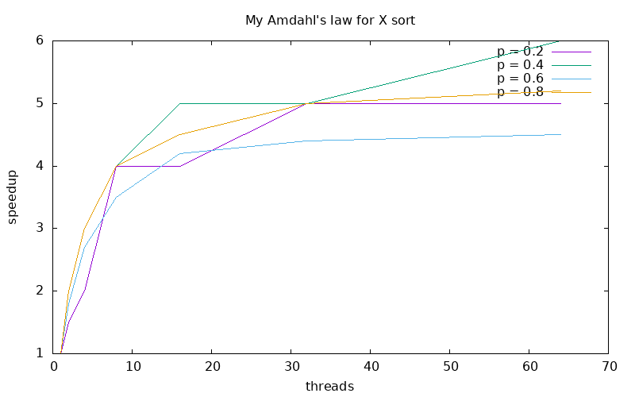

# Lab 2 - Java Parallel Sorting Algorithms
- Group 18
- Wenqi Cao ~~and Simon Dussud~~
- Our [GitHub Repo, Lab2](https://github.com/DD2443-Lab-Group18/DD2443-LAB2-Java-Parallel-Sorting) Contents

## Task 1: Sequential Sort
We chose to implement MergeSort/QuickSort ...

Source file:
- `src/SequentialSort.java`

Test file:
- `tests/TestSequential.java`

## Task 2: Amdahl's Law

Our Amdahl's law ...

Here is a plot of our version of Amdahl's law ...

We see that ...

## Task 3: ExecutorServiceSort

Source file:
- `src/ExecutorServiceSort.java`

Test file:
- `tests/TestExecutorService.java`

We decided to ...

## Task 4: ForkJoinPoolSort

Source file:
- `src/ForkJoinPoolSort.java`

Test file:
- `tests/TestForkJoinPool.java`

We decided to ...

## Task 5: ParallelStreamSort

Source file:
- `src/ParallelStreamSort.java`

Test file:
- `tests/TestParallelStream.java`

We decided to ...

## Task 6: Performance measurements with PDC

We decided to sort 10,000,000 integers ...

We see that ...

## Acknowledgements

The test cases for the Java sorting algorithms were generated with the assistance of OpenAI's ChatGPT.
This tool was only used to automate the validation of the code to ensure functionalities.
