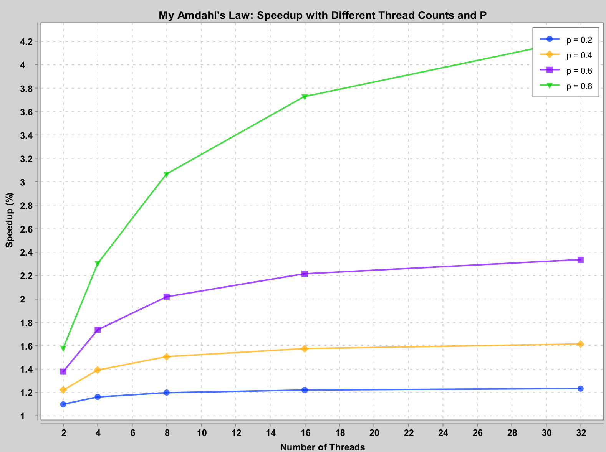
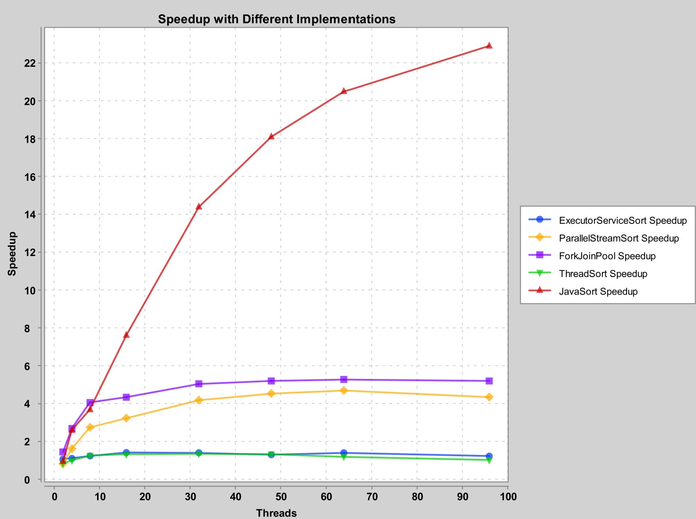

# Lab 2 - Java Parallel Sorting Algorithms
- Group 18
- Wenqi Cao ~~and Simon Dussud~~
- Our [GitHub Repo, Lab2](https://github.com/DD2443-Lab-Group18/DD2443-LAB2-Java-Parallel-Sorting) Contents

## Task 1: Sequential Sort

> We chose to implement QuickSort.

Source file:
- `src/SequentialSort.java`

Test file:
- `tests/TestSequential.java`

## Task 2: Amdahl's Law

> Our Amdahl's law is $S=\frac{1}{(1−P)+\frac{P\cdot{}E(N)}{N}}$, where $E(N)$ is the parallel efficiency.
> The parallel efficiency is a function of N, but it is also affected by the computational power of the hardware.

> For simplicity, we assume that E(N) is $N^{1/9}$ in plotting for N < 512.

Source file:
- `plots/MyAmdahlPlot.java`

Here is a plot of our version of Amdahl's law.



> We see that it is very close to the original Amdahl's law.

> We also noticed that if the array size is small, 
> e.g., less than 100, parallelization hardly gives any improvements on the execution time.

## Task 3: ExecutorServiceSort

Source file:
- `src/ExecutorServiceSort.java`

Test file:
- `tests/TestExecutorService.java`

> We decided to use `newFixedThreadPool` of `ExecutorService`. 

> We also decided to run the tasks directly if threads are not available. 
> Because if the tasks recursively submit more child tasks and there aren't enough threads to execute them, 
> it can lead to the deadlock where child tasks are waiting for parent tasks to finish, 
> but the parent tasks are waiting for the child tasks to complete.

> Additionally, we parallelize only the left branch of recursive calls 
> to minimize contention and reduce the overhead associated with parallelizing both subtasks. 
> As a result, the performance is improved by roughly 30%.

> NOTICE: The current ver. of ExecutorServiceSort has race conditions as mentioned in Task 7!

## Task 4: ForkJoinPoolSort

Source file:
- `src/ForkJoinPoolSort.java`

Test file:
- `tests/TestForkJoinPool.java`

> We decided to use parallelism effectively by dividing the array into sub-arrays 
> and fork the tasks to execute them in parallel.

## Task 5: ParallelStreamSort

Source file:
- `src/ParallelStreamSort.java`

Test file:
- `tests/TestParallelStream.java`

> We decided to use streams and their parallel processing capabilities. 

> At first, we used this method to fork the parallel stream tasks. 
> However, this method actually utilizes the ForkJoinPoll `commonPool` for parallelism.
> 
> ```java
> ForkJoinTask<?> leftTask = pool.commonPool().submit(() -> {
>     Arrays.stream(new int[]{0}).parallel()
>           .forEach(i -> parallelQuickSort(arr, low, pivotIndex - 1));
> });
> ```

> Then we modify the method as follows.
> However, the code is still not an effective way to parallelize the quicksort algorithm. 
> `Arrays.stream(new int[] {0})` creates a stream from an array with just a single element, `0`. 
> 
> This doesn't result in any real parallelism, as the stream contains only one element. 
> Thereby, `forEach()` executes the lambda expression just once, as there's only one element to process in the stream.
> 
> ```java
> Arrays.stream(new int[]{0}).parallel()
>       .forEach(i -> parallelQuickSort(arr, low, pivotIndex - 1));
> 
> ```

> After that, we changed the code as follows.
> 
> ```java
> // Parallelize the two recursive calls with streams
> Arrays.stream(new int[] {0, 1}).parallel()
>       .forEach(i -> {
>                   if (i == 0) {
>                       parallelQuickSort(arr, low, pivotIndex - 1);
>                   } else {
>                       parallelQuickSort(arr, pivotIndex + 1, high);
>                   }
>       });
> 
> ```
> 
> `.parallel()` converts the stream into a parallel stream. 
> It allows the subsequent operations to be performed concurrently if the system resources permit.
> 
> `.forEach(...)` is a terminal operation that performs an action for each element in the stream.
> In this case, it's used to execute our sorting logic.
>
> Inside the lambda function:
> - If i is 0, it calls parallelQuickSort on the left partition (low to pivotIndex - 1).
> - If i is 1, it calls parallelQuickSort on the right partition (pivotIndex + 1 to high).

## Task 6: Performance measurements with PDC

> We decided to sort 10,000,000 integers.

Source file:
- `plots/MyPDCCode.java` (Run on PDC)
- `plots/MyPDCPlot.java` (Run Locally)



> We see that the `ForkJoinPoolSort` show better performance with larger thread counts due to more efficient parallelism.
> These results show the importance of balancing parallelism with overhead and optimizing thread utilization 
> to achieve effective performance gains.

## Task 7: ThreadSort

Source file:
- `src/ThreadSort.java`

Test file:
- `tests/ThreadSort.java`

> We utilize `start()` and `join()` from Java's Threads to achieve parallelism, and 
> keep track of the num of active threads using the `AtomicInteger` type.

> At first, we use both `atomicInteger.get()` and `atomicInteger.incrementAndGet()` calls. 
> 
> However, separating the `get()` and `incrementAndGet()` calls can lead to a race condition, 
> where multiple threads may read the same value of activeThreads before any updates are made.
>
> ```java
> 
> 
> 
> ```
> 
> Although both `get()` and `incrementAndGet()` are atomic individually,
> when used separately, the overall process is NOT atomic.

> Finally, we changed the code as follows using `compareAndSet()`. 
>
> ```java
> 
> 
> 
> ```
> 
> Another valid method to ensure the process atomic is using a lock (e.g., `ReentrantLock` in Java) yourself. 
> 
> While `AtomicInteger` provides non-blocking operations for atomic updates, using a `lock` allows you 
> to explicitly define a critical section, making the operations within that section mutually exclusive.

## Overall Comments & Discussion

> All sorting implmemtations here use recursive calls for parallelism. However, massive recursive calls 
> may lead to stack overflow problem if array size goes beyond certain level. While non-recursive sort 
> is a solution, achieving parallelism here is not an easy topic.

## Acknowledgements

The test cases for the Java sorting algorithms were generated with the assistance of OpenAI's ChatGPT.
This tool was only used to automate the validation of the code to ensure functionalities.
