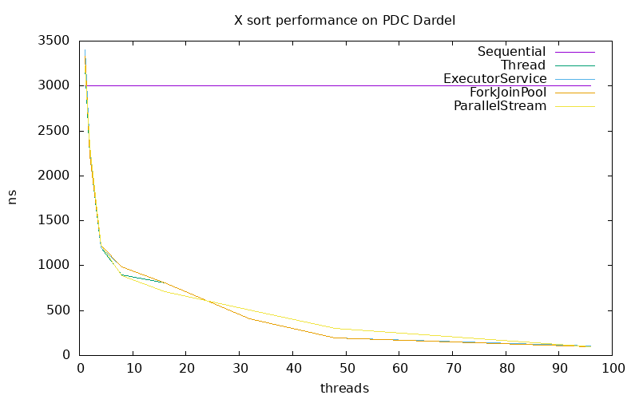

# Lab 2 - Java Parallel Sorting Algorithms
- Group 18
- Wenqi Cao ~~and Simon Dussud~~
- Our [GitHub Repo, Lab2](https://github.com/DD2443-Lab-Group18/DD2443-LAB2-Java-Parallel-Sorting) Contents

## Task 1: Sequential Sort

> We chose to implement QuickSort.

Source file:
- `src/SequentialSort.java`

Test file:
- `tests/TestSequential.java`

## Task 2: Amdahl's Law

> Our Amdahl's law is $S=\frac{1}{(1−P)+\frac{P\cdot{}E(N)}{N}}$, where $E(N)$ is the parallel efficiency.
> The parallel efficiency is a function of N, but it is also affected by the computational power of the hardware.

> For simplicity, we assume that E(N) is $N^{8/9}$ in plotting.

Here is a plot of our version of Amdahl's law.

> We see that it is very close to the original Amdahl's law.

## Task 3: ExecutorServiceSort

Source file:
- `src/ExecutorServiceSort.java`

Test file:
- `tests/TestExecutorService.java`

> We decided to use `newFixedThreadPool` of `ExecutorService`. 

> We also decided to run the tasks directly if threads are not available. 
> Because if the tasks recursively submit more child tasks and there aren't enough threads to execute them, 
> it can lead to the deadlock where child tasks are waiting for parent tasks to finish, 
> but the parent tasks are waiting for the child tasks to complete.

## Task 4: ForkJoinPoolSort

Source file:
- `src/ForkJoinPoolSort.java`

Test file:
- `tests/TestForkJoinPool.java`

> We decided to use parallelism effectively by dividing the array into sub-arrays 
> and fork the tasks to execute them in parallel.

## Task 5: ParallelStreamSort

Source file:
- `src/ParallelStreamSort.java`

Test file:
- `tests/TestParallelStream.java`

> We decided to use streams and their parallel processing capabilities. 
> However, as quicksort involves recursive partitioning, we think it isn't inherently suited for parallel streams.

## Task 6: Performance measurements with PDC

> We decided to sort 10,000,000 integers.

> We see that the `ForkJoinPoolSort` show slightly better performance with larger thread counts due to more efficient parallelism.
> These results show the importance of balancing parallelism with overhead and optimizing thread utilization 
> to achieve effective performance gains.

## Acknowledgements

The test cases for the Java sorting algorithms were generated with the assistance of OpenAI's ChatGPT.
This tool was only used to automate the validation of the code to ensure functionalities.
